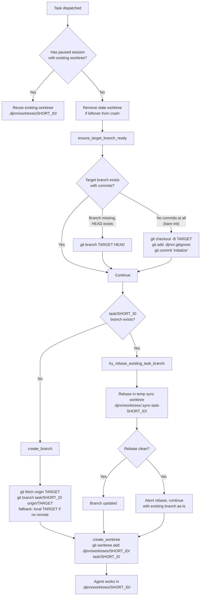
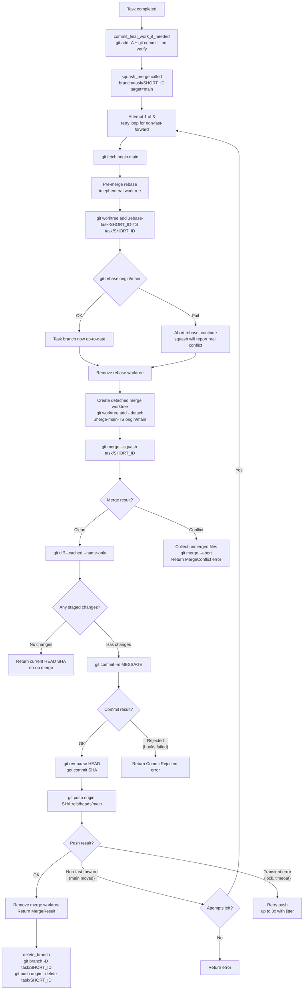
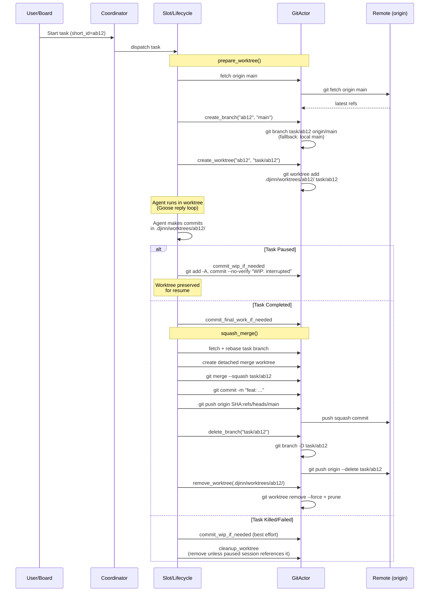
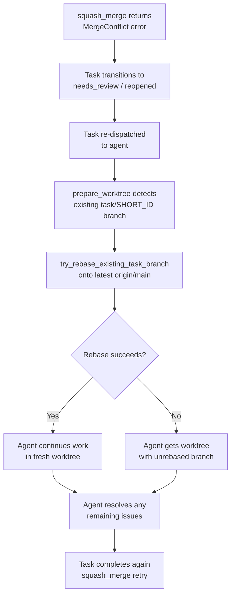
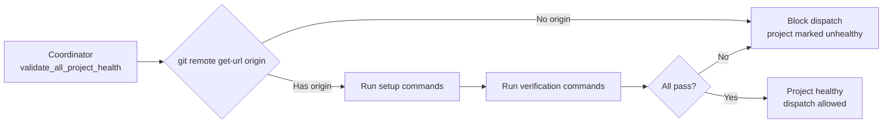

# Git Workflow Diagrams

## 1. Architecture Overview — GitActor

The GitActor is a hand-rolled Ryhl-pattern actor: one per project repository, serializing all git operations through an mpsc channel.

```
┌─────────────────────────────────────────────────────────┐
│                      AppState                           │
│                                                         │
│   git_actors: HashMap<PathBuf, GitActorHandle>          │
│                                                         │
│   get_or_spawn(path) ─► if missing, spawn new actor     │
└──────────────┬──────────────────────────────────────────┘
               │
               ▼
┌──────────────────────────┐       mpsc(32)       ┌──────────────────────────┐
│    GitActorHandle        │ ───── GitMessage ───► │       GitActor           │
│    (cheap Clone)         │                       │    (tokio::spawn)        │
│                          │ ◄── oneshot Reply ─── │                          │
│  • current_branch()      │                       │  Hybrid approach:        │
│  • status()              │                       │  • Reads  → git2 crate   │
│  • head_commit()         │                       │  • Writes → git CLI      │
│  • create_branch()       │                       │    (tokio::process)      │
│  • create_worktree()     │                       │                          │
│  • remove_worktree()     │                       │  Holds: git2::Repository │
│  • squash_merge()        │                       │  + repo path             │
│  • delete_branch()       │                       │                          │
│  • rebase_with_retry()   │                       │                          │
└──────────────────────────┘                       └──────────────────────────┘
```

---

## 2. Task Dispatch — Worktree Preparation Flow

When a task is dispatched for execution, `prepare_worktree()` sets up the isolated working directory.



---

## 3. Repository Layout — Worktree Structure

```
project-root/                         ← main working tree (user's checkout)
├── .djinn/
│   ├── .gitignore                    ← ignores worktrees/, etc.
│   ├── notes/                        ← knowledge base (git-tracked)
│   └── worktrees/
│       ├── ab12/                     ← task worktree (task/ab12 branch)
│       │   ├── .git                  ← linked worktree metadata
│       │   ├── src/
│       │   └── ...
│       ├── cd34/                     ← another task worktree
│       ├── .sync-task-ab12/          ← ephemeral rebase worktree (cleaned up)
│       ├── .rebase-task-ab12-17.../  ← ephemeral merge-time rebase (cleaned up)
│       ├── .merge-main-17.../        ← ephemeral squash-merge worktree (cleaned up)
│       └── batch-B001/               ← epic review worktree (detached HEAD)
└── .git/
    └── worktrees/                    ← git's internal worktree tracking
        ├── ab12/
        └── cd34/
```

---

## 4. Squash Merge Flow (Post-Task Completion)

When a task completes successfully, its branch is squash-merged into the target branch.



---

## 5. Branch Lifecycle — End to End



---

## 6. Conflict Resolution Flow



---

## 7. Retry and Error Handling Summary

| Scenario | Strategy | Max Attempts | Backoff |
|---|---|---|---|
| **Push transient errors** (lock, timeout, connection) | Retry same push | 3 | Exponential + jitter (200ms base) |
| **Push non-fast-forward** (main moved) | Re-fetch, re-rebase, re-merge, re-push | 3 | Exponential + jitter |
| **Rebase transient errors** | `rebase_with_retry` | 3 | Exponential + jitter |
| **Merge conflict** | Return `MergeConflict` with file list | No retry | Task reopened for agent |
| **Commit rejected** (hooks) | Return `CommitRejected` with stdout/stderr | No retry | Surfaced to caller |
| **No changes to merge** | Return current HEAD SHA (idempotent) | N/A | N/A |

---

## 8. Pre-flight Health Check

Before any task can be dispatched, the Coordinator validates project health:



A remote `origin` is required because the squash-merge flow pushes directly to it. Without it, tasks would loop infinitely (merge fails, task released, re-dispatched, fails again).

## Relations

- [[ADR-007 djinn Namespace Git Sync]]
- [[ADR-009 Simplified Execution]]
- [[ADR-015 Session Continuity and Resume]]