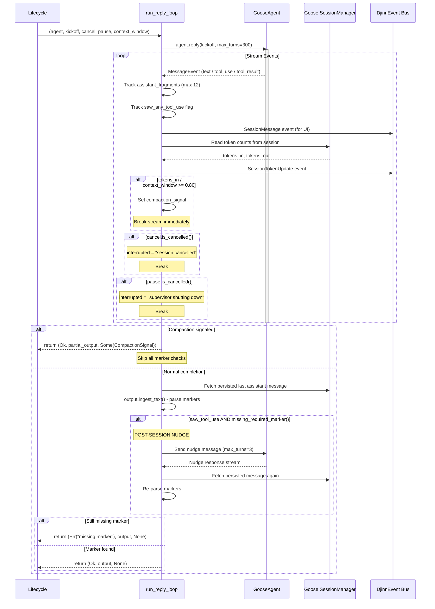
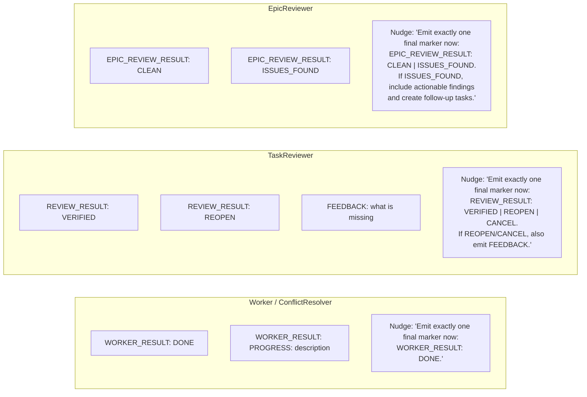
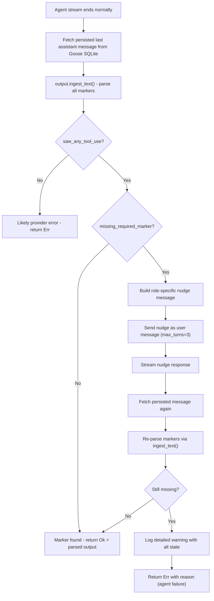

# Reply Loop, Nudge, and Marker System

How the agent streams responses, tracks tokens, parses markers, and gets nudged for missing output.

## Reply Loop Sequence

## Marker Types per Agent Role

## Nudge Timing Detail

## Key Design Decisions

- **Markers are parsed from Goose SQLite** (persisted messages), NOT from streaming chunks — ensures reliability
- **Nudge is limited to 3 turns** to prevent infinite loops if agent is confused
- **Compaction skips marker checks** — an agent at 80% context hasn't finished, markers aren't expected
- **saw_any_tool_use** distinguishes provider errors (no tools at all) from agent failures (worked but forgot marker)
- **ADR-012** established this pattern for structured output nudging

## Relations
- [[Task Lifecycle and Session Flow]]
- [[Session Resume and Compaction Flow]]
- [[Setup Verification and Merge Conflict Flow]]
- [[ADR-012: Epic Review Batches and Structured Output Nudging]]
