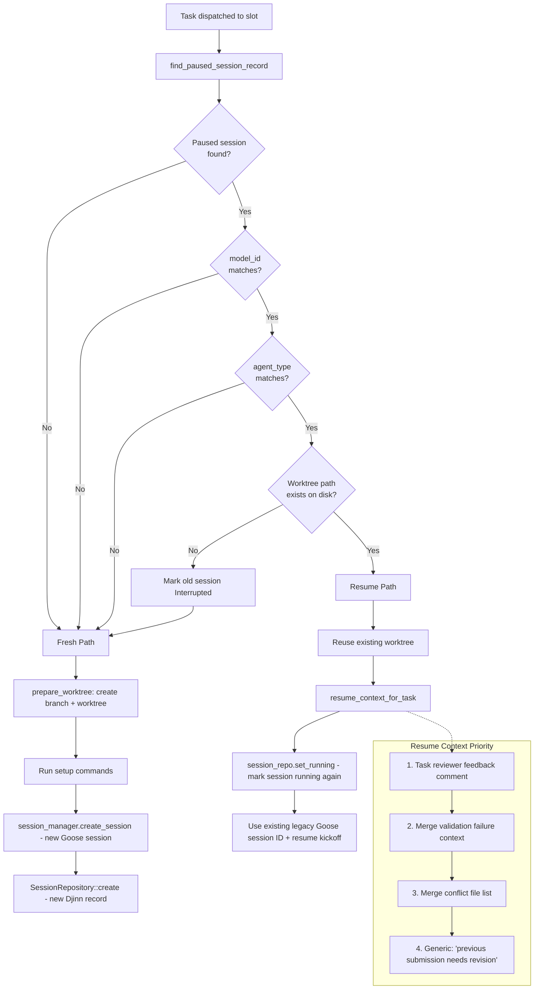
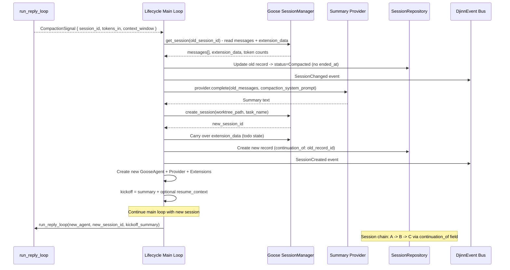
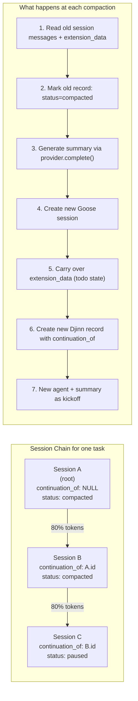

# Session Resume and Compaction Flow

How sessions are resumed from paused state and how context compaction works.

## Session Resume vs Fresh Decision

## Compaction Flow (Inline at 80% Context)

## Session Continuation Chain

## Session Record States

| State | When | Worktree | ended_at |
|-------|------|----------|----------|
| `running` | Active session | exists | NULL |
| `paused` | Worker DONE or pause signal | preserved | NULL |
| `completed` | Reviewer/epic session ends OK | cleaned up | set |
| `failed` | Session error | cleaned up | set |
| `interrupted` | Kill received | cleaned up | set |
| `compacted` | Inline compaction | preserved (reused by next) | NULL |

## Relations
- [[Task Dispatch and Slot Pool Flow]]
- [[Task Lifecycle and Session Flow]]
- [[decisions/adr-036-structured-session-finalization-finalize-tools-and-forced-tool-choice|ADR-036: Structured Session Finalization — Finalize Tools and Forced Tool Choice]]
- [[ADR-015: Session Continuity and Resume]]
