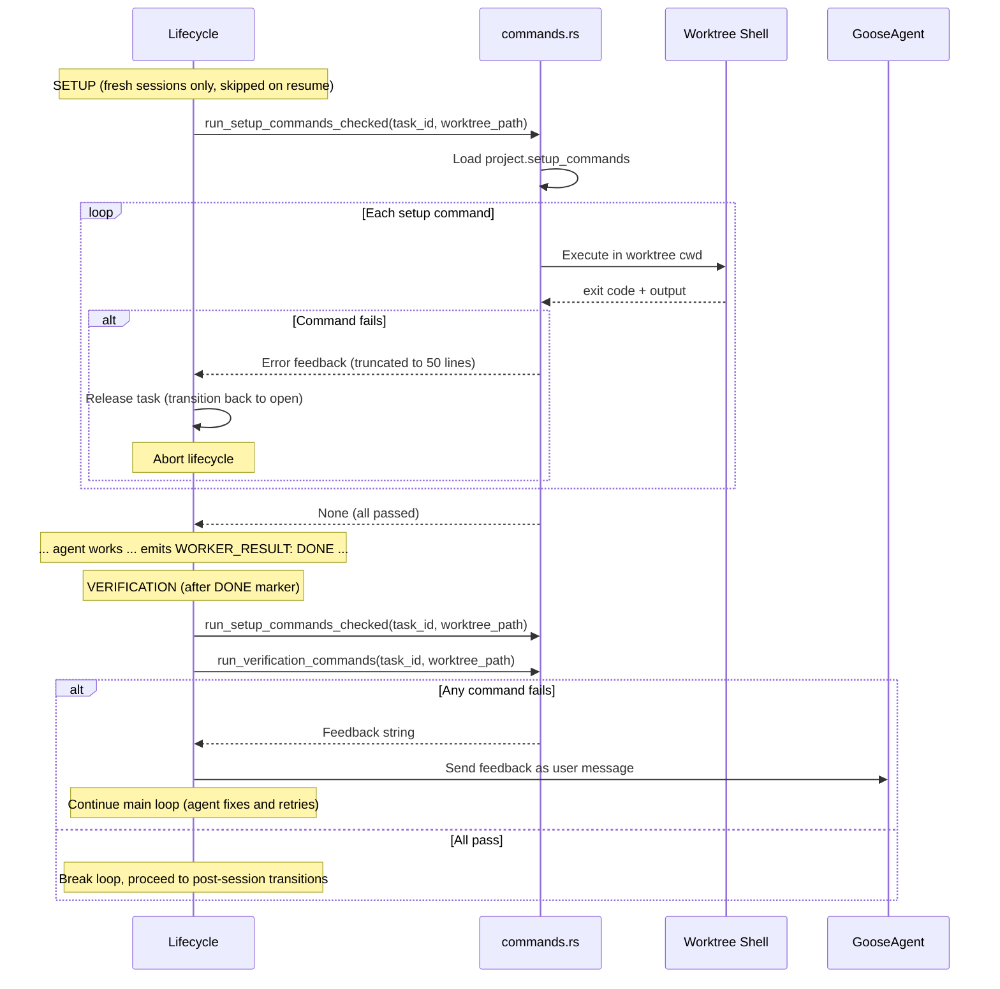
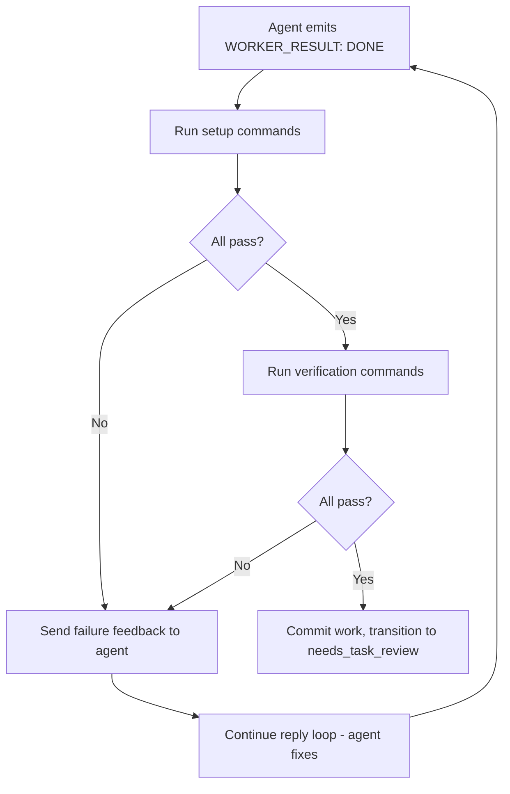
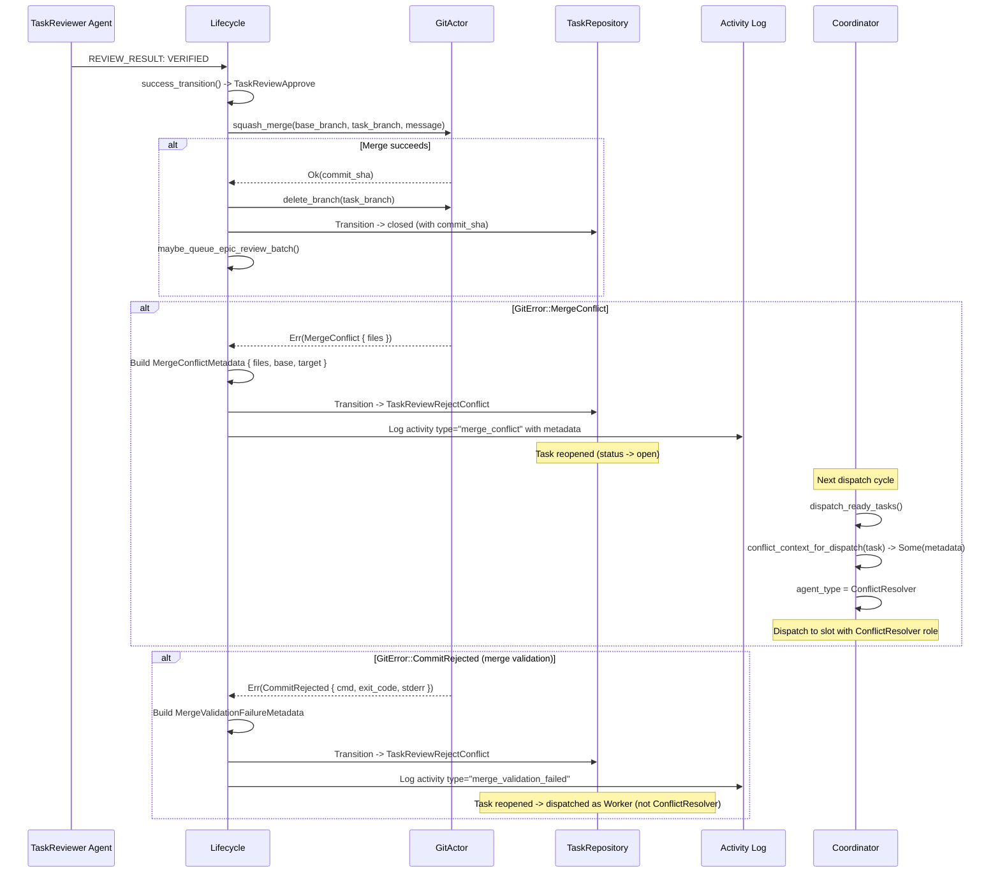
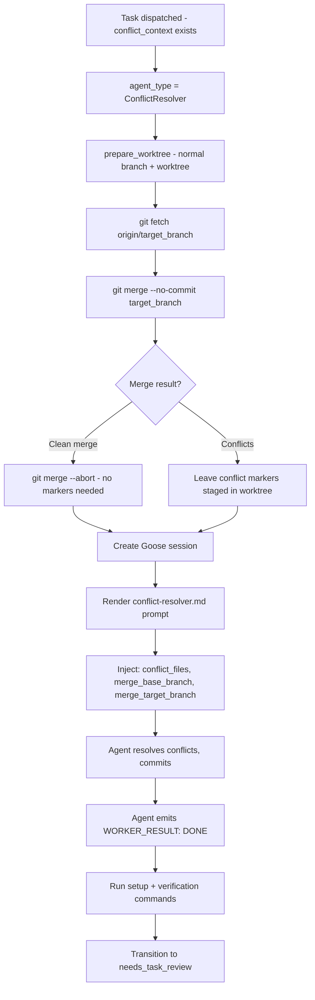
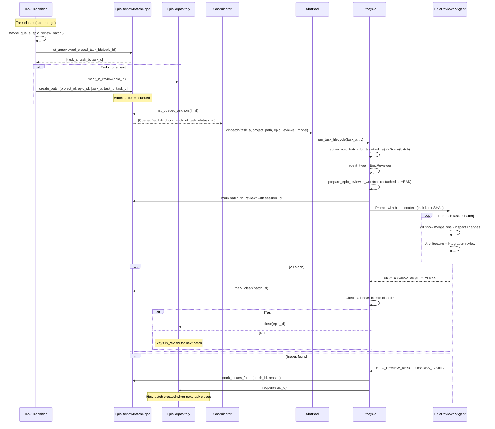

# Setup, Verification, Merge Conflict, and Epic Review Flows

## Setup and Verification Commands

## Verification Retry Loop

## Merge Conflict Flow

## Conflict Resolver Session Setup

## Epic Review Flow

## Relations
- [[Task Lifecycle and Session Flow]]
- [[decisions/adr-036-structured-session-finalization-finalize-tools-and-forced-tool-choice|ADR-036: Structured Session Finalization — Finalize Tools and Forced Tool Choice]]
- [[Task Dispatch and Slot Pool Flow]]
- [[decisions/adr-024-agent-role-redesign-pm-architect-and-approval-pipeline|ADR-024: Agent Role Redesign — PM, Architect, and Approval Pipeline]]
- [[decisions/adr-014-project-setup-verification-commands|ADR-014: Project Setup and Verification Commands]]
