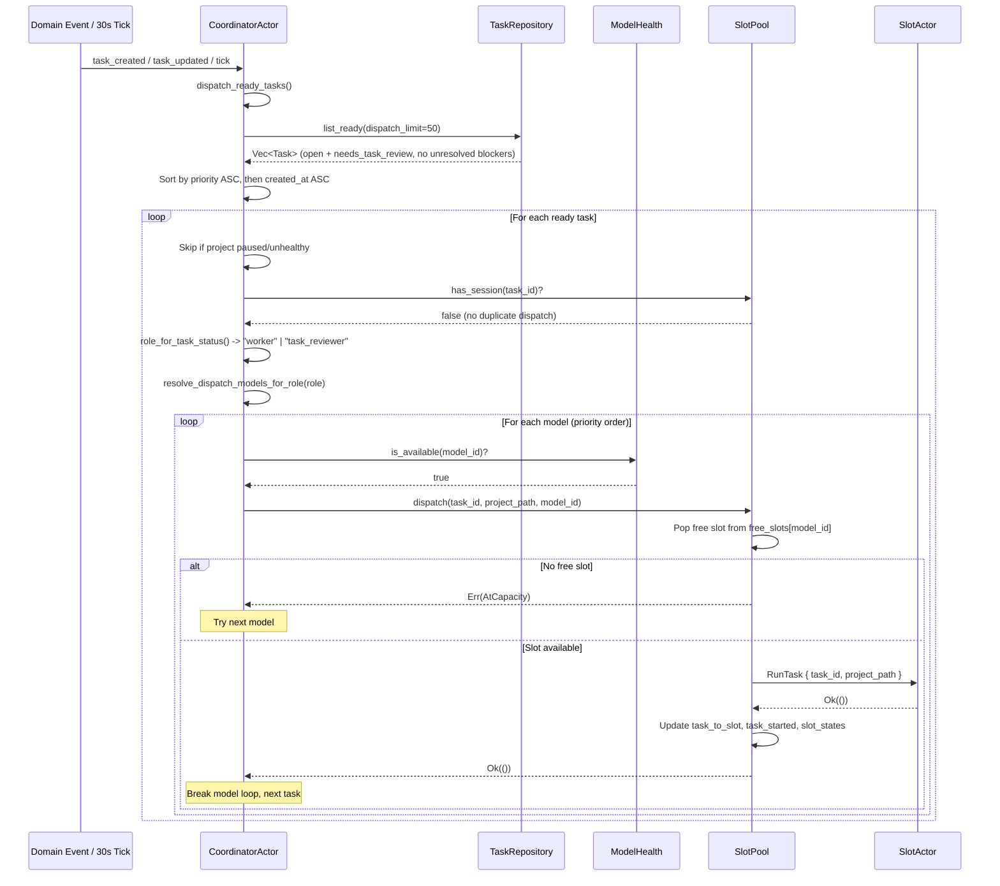
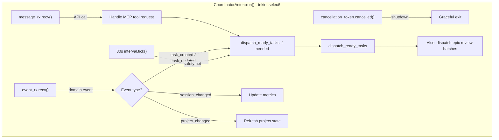

# Task Dispatch and Slot Pool Flow

How the coordinator picks up ready tasks and assigns them to execution slots.

## Task Dispatch Sequence



## Slot Pool State Machine

```mermaid
stateDiagram-v2
    [*] --> Free: Pool initialized

    Free --> Busy: RunTask command
    Busy --> Free: SlotEvent::Free (normal completion / pause)
    Busy --> Free: SlotEvent::Killed (task killed)

    Free --> Draining: Drain requested (idle)
    Busy --> BusyDraining: Drain requested (active)
    BusyDraining --> Draining: Task completes
    Draining --> [*]: Slot retired

    state Busy {
        [*] --> Running
        Running --> Pausing: pause token cancelled
        Running --> Killing: cancel token cancelled
        Pausing --> [*]: WIP commit + preserve worktree
        Killing --> [*]: WIP commit + cleanup worktree
    }
```

## Coordinator Main Loop



## Relations
- [[Task Lifecycle and Session Flow]]
- [[Session Resume and Compaction Flow]]
- [[decisions/adr-009-simplified-execution-—-no-phases,-direct-task-dispatch|ADR-009: Simplified Execution]]
