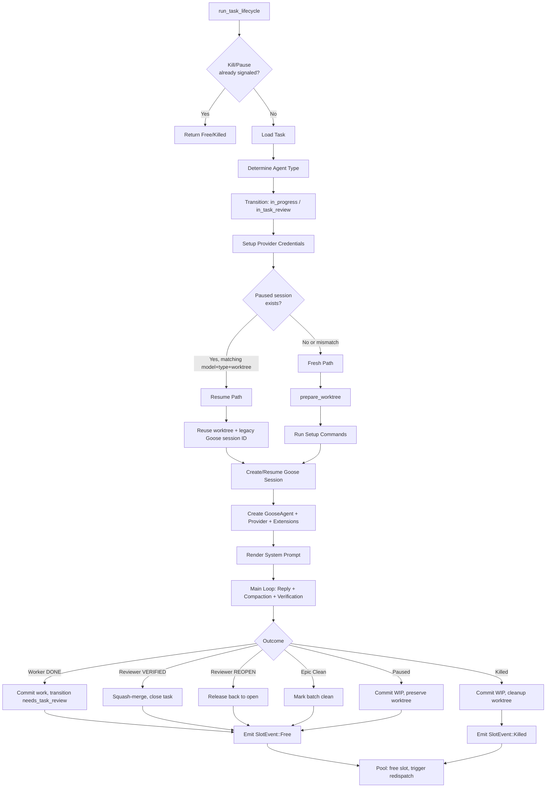
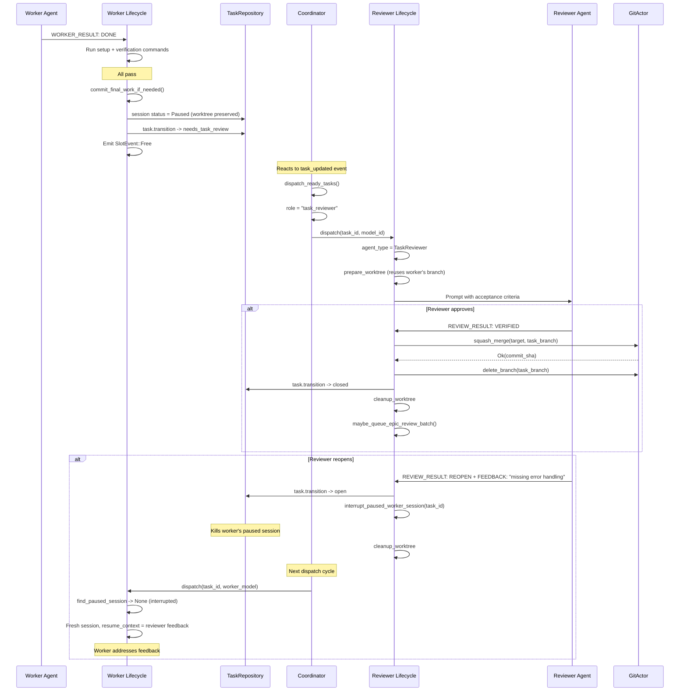

# Task Lifecycle and Session Flow

What happens inside a slot after dispatch, from load to completion.

## High-Level Lifecycle

## Pause vs Kill

```mermaid
flowchart TD
    subgraph "Pause (CancellationToken: pause)"
        P1[pause token cancelled] --> P2[Get final token counts]
        P2 --> P3["session_repo.pause() - status='paused', no ended_at"]
        P3 --> P4[commit_wip_if_needed - WIP commit]
        P4 --> P5[Worktree PRESERVED]
        P5 --> P6["Emit SlotEvent::Free"]
        P6 --> P7[Slot returned to pool]
        P7 --> P8["Next dispatch: find_paused_session -> RESUME"]
    end

    subgraph "Kill (CancellationToken: cancel)"
        K1[cancel token cancelled] --> K2[Get final token counts]
        K2 --> K3["session_repo.update() - status='interrupted', ended_at set"]
        K3 --> K4[commit_wip_if_needed - WIP commit]
        K4 --> K5[cleanup_worktree - REMOVED]
        K5 --> K6["transition_interrupted() - task back to 'open'"]
        K6 --> K7["Emit SlotEvent::Killed"]
        K7 --> K8[Slot returned to pool]
        K8 --> K9["Next dispatch: no paused session -> FRESH"]
    end
```

## Full Worker -> Review -> Merge Cycle

## Relations
- [[Task Dispatch and Slot Pool Flow]]
- [[Session Resume and Compaction Flow]]
- [[decisions/adr-036-structured-session-finalization-finalize-tools-and-forced-tool-choice|ADR-036: Structured Session Finalization — Finalize Tools and Forced Tool Choice]]
- [[Setup Verification and Merge Conflict Flow]]
