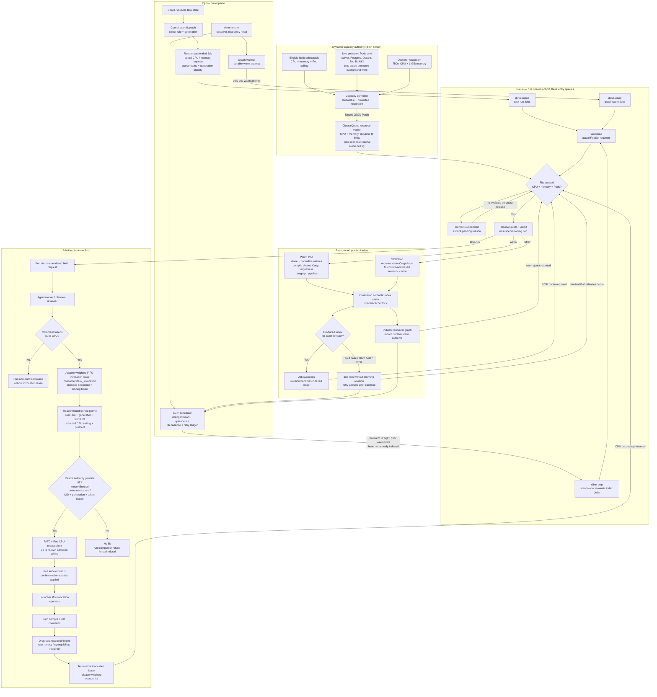

# Kueue admission and invocation resize architecture

This diagram is the operator/developer map for how Djinn turns durable work into Kubernetes Jobs,
shares one finite node across task-runs, graph warming, and standalone SCIP indexing, and temporarily
lifts CPU for a fenced build invocation.



## Reading the diagram

### Admission and capacity

Kueue is the authority that decides whether a Kubernetes Job may start. Djinn always renders the Job
with its real resource requests; Kueue creates a Workload and keeps the Job suspended until that PodSet
fits the shared ClusterQueue.

The capacity controller does not set a fixed concurrency number. For every eligible Node it derives:

```text
admissible vector = allocatable − live protected Pod requests − configured headroom
```

CPU and memory therefore limit work according to each Job's actual shape. The Pods dimension is only the
real post-reserve Kubernetes Pod ceiling; it is not a second build-shaped concurrency limit. Terminal
`Succeeded` and `Failed` protected Pods consume no resources and must not be included.

### Task-run versus invocation capacity

Kueue admits the whole task-run Pod. Inside that admitted Pod, a command that actually needs build CPU
uses the retained invocation lease. The two layers answer different questions:

- **Kueue:** may this Pod exist on the node now?
- **Invocation lease + resize:** may this exact, fenced command temporarily lift this Pod from its birth
  CPU request to the Pod's already-admitted ceiling?

The resize path fails closed. A stale generation, wrong Pod UID, wrong launcher protocol, disarmed
authority, missing permit, stale fencing token, rejected PATCH, or unconfirmed kubelet status cannot lift
`cpu.max`.

### Warm and SCIP coordination

The warm Job owns canonical graph publication and creates the reusable Cargo target base. The standalone
SCIP Job fills the semantic-index artifact cache for an exact repository revision; it never publishes the
served graph itself.

They do not run the expensive semantic phase concurrently for one project:

- a nonterminal warm Job blocks SCIP dispatch;
- both take the same cross-Pod semantic-index claim;
- a cold-base or contention skip makes SCIP fail, so it cannot falsely mark the revision indexed;
- the failed attempt consumes the cadence floor to prevent a crash loop, but remains retryable later;
- a successful exact-revision Job is the retained change-detection ledger.

### Quota release

Quota is returned when the Workload finishes. Separately, the dynamic capacity controller excludes
terminal protected Pods even while Kubernetes retains their API objects for logs or garbage collection.
This prevents a failed SCIP or warm Pod from shrinking the ClusterQueue and blocking its own recovery.
